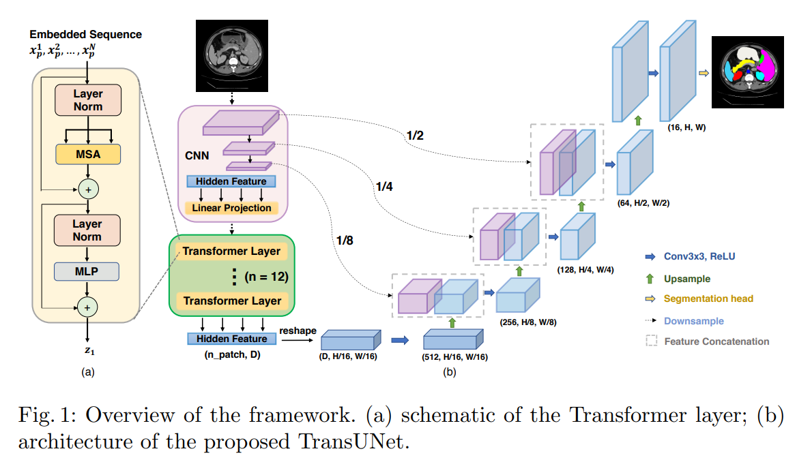

# Aini M⚙️dules


*A PyTorch Computer Vision (CV) module library for building n-D networks flexibly ~*

(*Simple-to-use & Function-rich!*)

Highlights
 - Simple code and detailed annotation
 - Easy and flexible to integrate with other codes
 - Support 1D / 2D / 3D networks (for 1D signal, 2D image, 3D video, 3D medical image...)
 - Abundant structure: CNN, GNN, Transformer
 - Friendly [demo](demo) codes
 - 🚀 Abundant Pretrained weights: including 80000+ `2D weights` and 80+ `3D weights`


Pretrained weights:
[[Google Drive]](https://drive.google.com/drive/folders/1Pbgrgf8Y8soc6RGMh3bSUSWVIW2WeEmA?usp=sharing)
 [[Baidu Netdisk `psw: wama` ]](https://pan.baidu.com/s/16sskSM5IuHLbXOC4YF5MQQ?pwd=wama)


Quick start with demo codes of 6 different novel multi-label network structures

*all model codes are re-constructed in a very simple way*

|Network| Publication | Demo code  | Paper link| Support multi-class per label|
|---|---|---|---|---|
|CNNRNN|CVPR2016|[code](demo/multi_label/Demo_CVPR2016_MultiLabel_CNNRNN.py)|[link](http://openaccess.thecvf.com/content_cvpr_2016/html/Wang_CNN-RNN_A_Unified_CVPR_2016_paper.html)|×|
|ML-GCN|CVPR2019|[code](demo/multi_label/Demo_CVPR2019_MultiLabel_ML_GCN.py)|[link](https://arxiv.org/abs/1904.03582)|×|
|SSGRL|ICCV2019|[code](demo/multi_label/Demo_ICCV2019_MultiLabel_SSGRL.py)|[link](https://arxiv.org/abs/1908.07325)|√|
|C-tran|CVPR2021|[code](demo/multi_label/Demo_CVPR2021_MultiLabel_C_tran.py)|[link](https://arxiv.org/abs/2011.14027)|√|
|ML-decoder|arxiv2021|[code](demo/multi_label/Demo_Arxiv2021_MultiLabel_ML_decoder.py)|[link](http://arxiv.org/abs/2111.12933)|√|
|Q2L|arxiv2021|[code](demo/multi_label/Demo_ArXiv2021_MultiLabel_Query2Label.py)|[link](https://arxiv.org/abs/2107.10834)|√|


## 1. Installation
🔥 [wama_modules](https://github.com/WAMAWAMA/wama_modules) 
`Basic` `1D/2D/3D`

Install `wama_modules` with command ↓
```
pip install git+https://github.com/WAMAWAMA/wama_modules.git
```
<details>
<summary> Other ways to install (or use) wama_modules</summary>

 -  Way1: Download code and run `python setup.py install`
 -  Way2: Directly copy the folder `wama_modules` into your project path

</details>

💧 [segmentation_models_pytorch](https://github.com/qubvel/segmentation_models.pytorch) 
`Optional` `2D` `100+ pretrained weights`

<details>
<summary> Introduction and installation command </summary>

`segmentation_models_pytorch` (called `smp`)
is a 2D CNN lib including many backbones and decoders, which is highly recommended to install for cooperating with this library. 

*Our codes have already contained `smp`, but you can still install the latest version with the code below.

Install with pip ↓
```
pip install segmentation-models-pytorch
```
Install the latest version ↓
```
pip install git+https://github.com/rwightman/pytorch-image-models.git
```

</details>

💧 [transformers](https://github.com/huggingface/transformers) 
`Optional` `2D` `80000+ pretrained weights`

<details>
<summary> Introduction and installation command </summary>

`transformer` (powered by Huggingface) is a lib including super abundant CNN and Transformer structures, which is highly recommended to install for cooperating with this library. 

Install `transformer` with pip ↓
```
pip install transformers
```

</details>

💧 [timm](https://github.com/rwightman/pytorch-image-models) 
`Optional` `2D` `400+ pretrained weights` 

<details>
<summary> Introduction and installation command </summary>

`timm` is a lib includes abundant CNN and Transformer structures, which is highly recommended to install for cooperating with this library. 

Install with pip ↓
```
pip install timm
```
Install the latest version ↓
```
pip install git+https://github.com/rwightman/pytorch-image-models.git
```
</details>


## 2. Update list
 - 2022/11/11:  The birthday of this code, version `v0.0.1`
 - 2023/01/23:  Add [demo](demo/multi_label) code of 6 multi-label network structures (Happy Chinese New Year 🎇)
 - ...


## 3. Main modules and network architectures
An overview of this repo (let's call `wama_modules` as `wm`)


|File|Description  | Main class or function  |
|---|---|---|
|[`wm.utils`](wama_modules/utils.py)          |Some operations on tensors and pre-training weights | `resizeTensor()` `tensor2array()` `load_weights()` |
|[`wm.thirdparty_lib`]((wama_modules/thirdparty_lib)  ) |2D/3D network structures (CNN/GNN/Transformer) from other repositories, and all are with pre-trained weights 🚀  | `MedicalNet` `C3D` `3D_DenseNet` `3D_shufflenet` `transformers.ConvNextModel` `transformers.SwinModel` `Radimagenet`|
|[`wm.Attention`](wama_modules/Attention.py)       |Some attention-based plugins   | `SCSEModule` `NonLocal`  |
|[`wm.BaseModule`](wama_modules/BaseModule.py)     |Basic modules(layers). For example, BottleNeck block (ResBlock) in ResNet, and DenseBlock in DenseNet, etc.   |`MakeNorm()` `MakeConv()` `MakeActive()` `VGGBlock` `ResBlock` `DenseBlock` |
|[`wm.Encoder`](wama_modules/Encoder.py)        |Some encoders such like ResNet or DenseNet, but with more flexibility for building the network modularly, and 1D/2D/3D are all supported   |`VGGEncoder` `ResNetEncoder` `DenseNetEncoder` |
|[`wm.Decoder`](wama_modules/Decoder.py)        |Some encoders with more flexibility for building the network modularly, and 1D/2D/3D are all supported   | `UNet_decoder`  |
|[`wm.Neck`](wama_modules/Neck.py)           |Modules for making the multi-scale features (from encoder) interact with each other to generate stronger features | `FPN` |
|[`wm.Transformer`](wama_modules/Transformer.py)    |Some self-attention or cross-attention modules, which can be used to build ViT, DETR or TransUnet   | `TransformerEncoderLayer` `TransformerDecoderLayer` |
|[`wm.PositionEmbedding`](wama_modules/PositionEmbedding.py)|Some position embedding modules, such as the learnable embedding, or 1/2/3D sincos embedding in MAE or Vit| `PositionalEncoding_1D_sincos` `PositionalEncoding_2D_sincos` `PositionalEncoding_3D_sincos` |


 - How to build your networks modularly and freely? 👉 See ['Guideline 1: Build networks modularly'](https://github.com/WAMAWAMA/wama_modules#4-guideline-1-build-networks-modularly)  below ~
 - How to use pretrained model with `wm.thirdparty_lib`? 👉 See ['Guideline 2: Use pretrained weights'](https://github.com/WAMAWAMA/wama_modules#5-guideline-2-use-pretrained-weights)  below ~


## 4. Guideline 1: Build networks modularly
How to build a network modularly?  Here's a paradigm ↓

***'Design architecture according to tasks, pick modules according to architecture'***

So, network architectures for different tasks can be viewed modularly such as:
 - VGG for classification `=` VGG_encoder `+` classification_head
 - ResNet for classification` = `ResNet_encoder` + `classification_head
 - Unet for segmentation` = `encoder` + `decoder` + `segmentation_head
 - A multi-task net for classification and segmentation` = `encoder` + `decoder` + `cls_head` + `seg_head


For example, build a 3D resnet50 encoder to output multi-scale feature maps ↓


```python
from wama_modules.Encoder import ResNetEncoder
import torch

dim = 3  # input is 3D volume
in_channels = 3
input = torch.ones([2, in_channels, 64, 64, 64])
encoder = ResNetEncoder(
    in_channels,
    stage_output_channels=[64, 128, 256],
    blocks=[6, 12, 24],
    downsample_ration=[0.5, 0.5, 0.5],  # set your downsampling speed
    dim=dim
)
multi_scale_f = encoder(input)
_ = [print(i.shape) for i in multi_scale_f]

# --------------------------------
# output 👇
# torch.Size([2, 64, 15, 15, 15])
# torch.Size([2, 128, 7, 7, 7])
# torch.Size([2, 256, 3, 3, 3])
# --------------------------------
```


Here are more demos shown below ↓ (Click to view codes, or visit the [`demo`](demo) folder)


<details>
<summary> Demo0: Build a 3D VGG for Single Label Classification  </summary>
 
```python
import torch
import torch.nn as nn
from wama_modules.Encoder import VGGEncoder
from wama_modules.Head import ClassificationHead
from wama_modules.BaseModule import GlobalMaxPool


class Model(nn.Module):
    def __init__(self, in_channel, label_category_dict, dim=2):
        super().__init__()
        # encoder
        f_channel_list = [64, 128, 256, 512]
        self.encoder = VGGEncoder(
            in_channel,
            stage_output_channels=f_channel_list,
            blocks=[1, 2, 3, 4],
            downsample_ration=[0.5, 0.5, 0.5, 0.5],
            dim=dim)
        # cls head
        self.cls_head = ClassificationHead(label_category_dict, f_channel_list[-1])
        self.pooling = GlobalMaxPool()

    def forward(self, x):
        f = self.encoder(x)
        logits = self.cls_head(self.pooling(f[-1]))
        return logits


if __name__ == '__main__':
    x = torch.ones([2, 1, 64, 64, 64])
    label_category_dict = dict(is_malignant=4)
    model = Model(in_channel=1, label_category_dict=label_category_dict, dim=3)
    logits = model(x)
    print('single-label predicted logits')
    _ = [print('logits of ', key, ':', logits[key].shape) for key in logits.keys()]

    # output 👇
    # single-label predicted logits
    # logits of  is_malignant : torch.Size([2, 4])
```
</details>


<details>
<summary> Demo1: Build a 3D ResNet for Single Label Classification </summary>
 
```python
import torch
import torch.nn as nn
from wama_modules.Encoder import ResNetEncoder
from wama_modules.Head import ClassificationHead
from wama_modules.BaseModule import GlobalMaxPool


class Model(nn.Module):
    def __init__(self, in_channel, label_category_dict, dim=2):
        super().__init__()
        # encoder
        f_channel_list = [64, 128, 256, 512]
        self.encoder = ResNetEncoder(
            in_channel,
            stage_output_channels=f_channel_list,
            stage_middle_channels=f_channel_list,
            blocks=[1, 2, 3, 4],
            type='131',
            downsample_ration=[0.5, 0.5, 0.5, 0.5],
            dim=dim)
        # cls head
        self.cls_head = ClassificationHead(label_category_dict, f_channel_list[-1])
        self.pooling = GlobalMaxPool()

    def forward(self, x):
        f = self.encoder(x)
        logits = self.cls_head(self.pooling(f[-1]))
        return logits


if __name__ == '__main__':
    x = torch.ones([2, 1, 64, 64, 64])
    label_category_dict = dict(is_malignant=4)
    model = Model(in_channel=1, label_category_dict=label_category_dict, dim=3)
    logits = model(x)
    print('single-label predicted logits')
    _ = [print('logits of ', key, ':', logits[key].shape) for key in logits.keys()]

    # output 👇
    # single-label predicted logits
    # logits of  is_malignant : torch.Size([2, 4])
```
</details>


<details>
<summary> Demo2: Build a  ResNet for Multi-Label Classification </summary>
 
```python
import torch
import torch.nn as nn
from wama_modules.Encoder import ResNetEncoder
from wama_modules.Head import ClassificationHead
from wama_modules.BaseModule import GlobalMaxPool


class Model(nn.Module):
    def __init__(self, in_channel, label_category_dict, dim=2):
        super().__init__()
        # encoder
        f_channel_list = [64, 128, 256, 512]
        self.encoder = ResNetEncoder(
            in_channel,
            stage_output_channels=f_channel_list,
            stage_middle_channels=f_channel_list,
            blocks=[1, 2, 3, 4],
            type='131',
            downsample_ration=[0.5, 0.5, 0.5, 0.5],
            dim=dim)
        # cls head
        self.cls_head = ClassificationHead(label_category_dict, f_channel_list[-1])

        self.pooling = GlobalMaxPool()

    def forward(self, x):
        f = self.encoder(x)
        logits = self.cls_head(self.pooling(f[-1]))
        return logits


if __name__ == '__main__':
    x = torch.ones([2, 1, 64, 64, 64])
    label_category_dict = dict(shape=4, color=3, other=13)
    model = Model(in_channel=1, label_category_dict=label_category_dict, dim=3)
    logits = model(x)
    print('multi_label predicted logits')
    _ = [print('logits of ', key, ':', logits[key].shape) for key in logits.keys()]

    # out
    # multi_label predicted logits
    # logits of  shape : torch.Size([2, 4])
    # logits of  color : torch.Size([2, 3])
    # logits of  other : torch.Size([2, 13])
```
</details>


<details>
<summary> Demo3: Build a ResNetUnet for Single Label Segmentation  </summary>
 
```python
import torch
import torch.nn as nn
from wama_modules.Encoder import ResNetEncoder
from wama_modules.Decoder import UNet_decoder
from wama_modules.Head import SegmentationHead
from wama_modules.utils import resizeTensor


class Model(nn.Module):
    def __init__(self, in_channel, label_category_dict, dim=2):
        super().__init__()
        # encoder
        Encoder_f_channel_list = [64, 128, 256, 512]
        self.encoder = ResNetEncoder(
            in_channel,
            stage_output_channels=Encoder_f_channel_list,
            stage_middle_channels=Encoder_f_channel_list,
            blocks=[1, 2, 3, 4],
            type='131',
            downsample_ration=[0.5, 0.5, 0.5, 0.5],
            dim=dim)
        # decoder
        Decoder_f_channel_list = [32, 64, 128]
        self.decoder = UNet_decoder(
            in_channels_list=Encoder_f_channel_list,
            skip_connection=[False, True, True],
            out_channels_list=Decoder_f_channel_list,
            dim=dim)
        # seg head
        self.seg_head = SegmentationHead(
            label_category_dict,
            Decoder_f_channel_list[0],
            dim=dim)

    def forward(self, x):
        multi_scale_f1 = self.encoder(x)
        multi_scale_f2 = self.decoder(multi_scale_f1)
        f_for_seg = resizeTensor(multi_scale_f2[0], size=x.shape[2:])
        logits = self.seg_head(f_for_seg)
        return logits


if __name__ == '__main__':
    x = torch.ones([2, 1, 128, 128, 128])
    label_category_dict = dict(organ=3)
    model = Model(in_channel=1, label_category_dict=label_category_dict, dim=3)
    logits = model(x)
    print('multi_label predicted logits')
    _ = [print('logits of ', key, ':', logits[key].shape) for key in logits.keys()]

    # out
    # multi_label predicted logits
    # logits of  organ : torch.Size([2, 3, 128, 128, 128])
```
</details>


<details>
<summary> Demo4: Build a ResNetUnet for Multi-Label Segmentation  </summary>

```python
import torch
import torch.nn as nn
from wama_modules.Encoder import ResNetEncoder
from wama_modules.Decoder import UNet_decoder
from wama_modules.Head import SegmentationHead
from wama_modules.utils import resizeTensor


class Model(nn.Module):
    def __init__(self, in_channel, label_category_dict, dim=2):
        super().__init__()
        # encoder
        Encoder_f_channel_list = [64, 128, 256, 512]
        self.encoder = ResNetEncoder(
            in_channel,
            stage_output_channels=Encoder_f_channel_list,
            stage_middle_channels=Encoder_f_channel_list,
            blocks=[1, 2, 3, 4],
            type='131',
            downsample_ration=[0.5, 0.5, 0.5, 0.5],
            dim=dim)
        # decoder
        Decoder_f_channel_list = [32, 64, 128]
        self.decoder = UNet_decoder(
            in_channels_list=Encoder_f_channel_list,
            skip_connection=[False, True, True],
            out_channels_list=Decoder_f_channel_list,
            dim=dim)
        # seg head
        self.seg_head = SegmentationHead(
            label_category_dict,
            Decoder_f_channel_list[0],
            dim=dim)

    def forward(self, x):
        multi_scale_f1 = self.encoder(x)
        multi_scale_f2 = self.decoder(multi_scale_f1)
        f_for_seg = resizeTensor(multi_scale_f2[0], size=x.shape[2:])
        logits = self.seg_head(f_for_seg)
        return logits


if __name__ == '__main__':
    x = torch.ones([2, 1, 128, 128, 128])
    label_category_dict = dict(organ=3, tumor=4)
    model = Model(in_channel=1, label_category_dict=label_category_dict, dim=3)
    logits = model(x)
    print('multi_label predicted logits')
    _ = [print('logits of ', key, ':', logits[key].shape) for key in logits.keys()]
    
    # out
    # multi_label predicted logits
    # logits of  organ : torch.Size([2, 3, 128, 128, 128])
    # logits of  tumor : torch.Size([2, 4, 128, 128, 128])
```
</details>


<details>
<summary> Demo5: Build a MultiTask net for Segmentation and Classfification  </summary>
 
```python
import torch
import torch.nn as nn
from wama_modules.Encoder import ResNetEncoder
from wama_modules.Decoder import UNet_decoder
from wama_modules.Head import SegmentationHead, ClassificationHead
from wama_modules.utils import resizeTensor
from wama_modules.BaseModule import GlobalMaxPool


class Model(nn.Module):
    def __init__(self,
                 in_channel,
                 seg_label_category_dict,
                 cls_label_category_dict,
                 dim=2):
        super().__init__()
        # encoder
        Encoder_f_channel_list = [64, 128, 256, 512]
        self.encoder = ResNetEncoder(
            in_channel,
            stage_output_channels=Encoder_f_channel_list,
            stage_middle_channels=Encoder_f_channel_list,
            blocks=[1, 2, 3, 4],
            type='131',
            downsample_ration=[0.5, 0.5, 0.5, 0.5],
            dim=dim)
        # decoder
        Decoder_f_channel_list = [32, 64, 128]
        self.decoder = UNet_decoder(
            in_channels_list=Encoder_f_channel_list,
            skip_connection=[False, True, True],
            out_channels_list=Decoder_f_channel_list,
            dim=dim)
        # seg head
        self.seg_head = SegmentationHead(
            seg_label_category_dict,
            Decoder_f_channel_list[0],
            dim=dim)
        # cls head
        self.cls_head = ClassificationHead(cls_label_category_dict, Encoder_f_channel_list[-1])

        # pooling
        self.pooling = GlobalMaxPool()

    def forward(self, x):
        # get encoder features
        multi_scale_encoder = self.encoder(x)
        # get decoder features
        multi_scale_decoder = self.decoder(multi_scale_encoder)
        # perform segmentation
        f_for_seg = resizeTensor(multi_scale_decoder[0], size=x.shape[2:])
        seg_logits = self.seg_head(f_for_seg)
        # perform classification
        cls_logits = self.cls_head(self.pooling(multi_scale_encoder[-1]))
        return seg_logits, cls_logits

if __name__ == '__main__':
    x = torch.ones([2, 1, 128, 128, 128])
    seg_label_category_dict = dict(organ=3, tumor=2)
    cls_label_category_dict = dict(shape=4, color=3, other=13)
    model = Model(
        in_channel=1,
        cls_label_category_dict=cls_label_category_dict,
        seg_label_category_dict=seg_label_category_dict,
        dim=3)
    seg_logits, cls_logits = model(x)
    print('multi_label predicted logits')
    _ = [print('seg logits of ', key, ':', seg_logits[key].shape) for key in seg_logits.keys()]
    print('-'*30)
    _ = [print('cls logits of ', key, ':', cls_logits[key].shape) for key in cls_logits.keys()]

    # out
    # multi_label predicted logits
    # seg logits of  organ : torch.Size([2, 3, 128, 128, 128])
    # seg logits of  tumor : torch.Size([2, 2, 128, 128, 128])
    # ------------------------------
    # cls logits of  shape : torch.Size([2, 4])
    # cls logits of  color : torch.Size([2, 3])
    # cls logits of  other : torch.Size([2, 13])
```
</details>


<details>
<summary> Demo6: Build a Unet with a resnet encoder and a FPN neck </summary>
 
```python
import torch
import torch.nn as nn
from wama_modules.Encoder import ResNetEncoder
from wama_modules.Decoder import UNet_decoder
from wama_modules.Head import SegmentationHead
from wama_modules.utils import resizeTensor
from wama_modules.Neck import FPN


class Model(nn.Module):
    def __init__(self, in_channel, label_category_dict, dim=2):
        super().__init__()
        # encoder
        Encoder_f_channel_list = [64, 128, 256, 512]
        self.encoder = ResNetEncoder(
            in_channel,
            stage_output_channels=Encoder_f_channel_list,
            stage_middle_channels=Encoder_f_channel_list,
            blocks=[1, 2, 3, 4],
            type='131',
            downsample_ration=[0.5, 0.5, 0.5, 0.5],
            dim=dim)

        # neck
        FPN_output_channel = 256
        FPN_channels = [FPN_output_channel]*len(Encoder_f_channel_list)
        self.neck = FPN(in_channels_list=Encoder_f_channel_list,
                 c1=FPN_output_channel//2,
                 c2=FPN_output_channel,
                 mode='AddSmall2Big',
                 dim=dim,)

        # decoder
        Decoder_f_channel_list = [32, 64, 128]
        self.decoder = UNet_decoder(
            in_channels_list=FPN_channels,
            skip_connection=[True, True, True],
            out_channels_list=Decoder_f_channel_list,
            dim=dim)
        # seg head
        self.seg_head = SegmentationHead(
            label_category_dict,
            Decoder_f_channel_list[0],
            dim=dim)

    def forward(self, x):
        multi_scale_encoder = self.encoder(x)
        multi_scale_neck = self.neck(multi_scale_encoder)
        multi_scale_decoder = self.decoder(multi_scale_neck)
        f_for_seg = resizeTensor(multi_scale_decoder[0], size=x.shape[2:])
        logits = self.seg_head(f_for_seg)
        return logits


if __name__ == '__main__':
    x = torch.ones([2, 1, 128, 128, 128])
    label_category_dict = dict(organ=3, tumor=4)
    model = Model(in_channel=1, label_category_dict=label_category_dict, dim=3)
    logits = model(x)
    print('multi_label predicted logits')
    _ = [print('logits of ', key, ':', logits[key].shape) for key in logits.keys()]

    # out
    # multi_label predicted logits
    # logits of  organ : torch.Size([2, 3, 128, 128, 128])
    # logits of  tumor : torch.Size([2, 4, 128, 128, 128])
```
</details>


<details>
<summary> Demo7: Build a 2D TransUnet for Segmentation </summary>

From paper : *TransUNet: Transformers Make Strong Encoders for Medical Image Segmentation*

Proposed by [Jieneng Chen](https://github.com/Beckschen)

[[paper]](https://arxiv.org/pdf/2102.04306.pdf)
[[official code]](https://github.com/Beckschen/TransUNet)
[Structure of TransUnet] 👇



Demo code 👇
```python
import torch
import torch.nn as nn
from wama_modules.Encoder import ResNetEncoder
from wama_modules.Decoder import UNet_decoder
from wama_modules.Head import SegmentationHead
from wama_modules.utils import resizeTensor
from transformers import ViTModel
from wama_modules.utils import load_weights, tmp_class


class TransUNet(nn.Module):
    def __init__(self, in_channel, label_category_dict, dim=2):
        super().__init__()

        # encoder
        Encoder_f_channel_list = [64, 128, 256, 512]
        self.encoder = ResNetEncoder(
            in_channel,
            stage_output_channels=Encoder_f_channel_list,
            stage_middle_channels=Encoder_f_channel_list,
            blocks=[1, 2, 3, 4],
            type='131',
            downsample_ration=[0.5, 0.5, 0.5, 0.5],
            dim=dim)

        # neck
        neck_out_channel = 768
        transformer = ViTModel.from_pretrained('google/vit-base-patch32-224-in21k')
        configuration = transformer.config
        self.trans_downsample_size = configuration.image_size = [8, 8]
        configuration.patch_size = [1, 1]
        configuration.num_channels = Encoder_f_channel_list[-1]
        configuration.encoder_stride = 1  # just for MAE decoder, otherwise this paramater is not used
        self.neck = ViTModel(configuration, add_pooling_layer=False)

        pretrained_weights = transformer.state_dict()
        pretrained_weights['embeddings.position_embeddings'] = self.neck.state_dict()[
            'embeddings.position_embeddings']
        pretrained_weights['embeddings.patch_embeddings.projection.weight'] = self.neck.state_dict()[
            'embeddings.patch_embeddings.projection.weight']
        pretrained_weights['embeddings.patch_embeddings.projection.bias'] = self.neck.state_dict()[
            'embeddings.patch_embeddings.projection.bias']
        self.neck = load_weights(self.neck, pretrained_weights)  # reload pretrained weights

        # decoder
        Decoder_f_channel_list = [32, 64, 128]
        self.decoder = UNet_decoder(
            in_channels_list=Encoder_f_channel_list[:-1]+[neck_out_channel],
            skip_connection=[True, True, True],
            out_channels_list=Decoder_f_channel_list,
            dim=dim)

        # seg head
        self.seg_head = SegmentationHead(
            label_category_dict,
            Decoder_f_channel_list[0],
            dim=dim)

    def forward(self, x):
        # encoder forward
        multi_scale_encoder = self.encoder(x)

        # neck forward
        f_neck = self.neck(resizeTensor(multi_scale_encoder[-1], size=self.trans_downsample_size))
        f_neck = f_neck.last_hidden_state
        f_neck = f_neck[:, 1:]  # remove class token
        f_neck = f_neck.permute(0, 2, 1)
        f_neck = f_neck.reshape(
            f_neck.shape[0],
            f_neck.shape[1],
            self.trans_downsample_size[0],
            self.trans_downsample_size[1]
        )  # reshape
        f_neck = resizeTensor(f_neck, size=multi_scale_encoder[-1].shape[2:])
        multi_scale_encoder[-1] = f_neck

        # decoder forward
        multi_scale_decoder = self.decoder(multi_scale_encoder)
        f_for_seg = resizeTensor(multi_scale_decoder[0], size=x.shape[2:])

        # seg_head forward
        logits = self.seg_head(f_for_seg)
        return logits


if __name__ == '__main__':
    x = torch.ones([2, 1, 256, 256])
    label_category_dict = dict(organ=3, tumor=4)
    model = TransUNet(in_channel=1, label_category_dict=label_category_dict, dim=2)
    with torch.no_grad():
        logits = model(x)
    print('multi_label predicted logits')
    _ = [print('logits of ', key, ':', logits[key].shape) for key in logits.keys()]

    # out
    # multi_label predicted logits
    # logits of  organ : torch.Size([2, 3, 256, 256])
    # logits of  tumor : torch.Size([2, 4, 256, 256])
```
</details>


<details>
<summary> Demo8: Build a 3D TransUnet  for Segmentation </summary>

*Original TransUnet only recieves 2D input. 
So if we want to build a 3D TransUnet, with the `tensor.reshape` operation in torch, 
we can temporarily convert 3D featuremap to 2D featuremap in the middle process, 
and then convert it back to 3D featuremap. You can find this process in the code of `neck forward`

```python
import torch
import torch.nn as nn
from wama_modules.Encoder import ResNetEncoder
from wama_modules.Decoder import UNet_decoder
from wama_modules.Head import SegmentationHead
from wama_modules.utils import resizeTensor
from transformers import ViTModel
from wama_modules.utils import load_weights, tmp_class


class TransUnet(nn.Module):
    def __init__(self, in_channel, label_category_dict, dim=2):
        super().__init__()

        # encoder
        Encoder_f_channel_list = [64, 128, 256, 512]
        self.encoder = ResNetEncoder(
            in_channel,
            stage_output_channels=Encoder_f_channel_list,
            stage_middle_channels=Encoder_f_channel_list,
            blocks=[1, 2, 3, 4],
            type='131',
            downsample_ration=[0.5, 0.5, 0.5, 0.5],
            dim=dim)

        # neck
        neck_out_channel = 768
        transformer = ViTModel.from_pretrained('google/vit-base-patch32-224-in21k')
        configuration = transformer.config
        self.trans_size_3D = [8, 8, 4]
        self.trans_size = configuration.image_size = [
            self.trans_size_3D[0], self.trans_size_3D[1]*self.trans_size_3D[2]
        ]
        configuration.patch_size = [1, 1]
        configuration.num_channels = Encoder_f_channel_list[-1]
        configuration.encoder_stride = 1  # just for MAE decoder, otherwise this paramater is not used
        self.neck = ViTModel(configuration, add_pooling_layer=False)

        pretrained_weights = transformer.state_dict()
        pretrained_weights['embeddings.position_embeddings'] = self.neck.state_dict()[
            'embeddings.position_embeddings']
        pretrained_weights['embeddings.patch_embeddings.projection.weight'] = self.neck.state_dict()[
            'embeddings.patch_embeddings.projection.weight']
        pretrained_weights['embeddings.patch_embeddings.projection.bias'] = self.neck.state_dict()[
            'embeddings.patch_embeddings.projection.bias']
        self.neck = load_weights(self.neck, pretrained_weights)  # reload pretrained weights

        # decoder
        Decoder_f_channel_list = [32, 64, 128]
        self.decoder = UNet_decoder(
            in_channels_list=Encoder_f_channel_list[:-1]+[neck_out_channel],
            skip_connection=[True, True, True],
            out_channels_list=Decoder_f_channel_list,
            dim=dim)

        # seg head
        self.seg_head = SegmentationHead(
            label_category_dict,
            Decoder_f_channel_list[0],
            dim=dim)

    def forward(self, x):
        # encoder forward
        multi_scale_encoder = self.encoder(x)

        # neck forward
        neck_input = resizeTensor(multi_scale_encoder[-1], size=self.trans_size_3D)
        neck_input = neck_input.reshape(neck_input.shape[0], neck_input.shape[1], *self.trans_size)  # 3D to 2D
        f_neck = self.neck(neck_input)
        f_neck = f_neck.last_hidden_state
        f_neck = f_neck[:, 1:]  # remove class token
        f_neck = f_neck.permute(0, 2, 1)
        f_neck = f_neck.reshape(
            f_neck.shape[0],
            f_neck.shape[1],
            self.trans_size[0],
            self.trans_size[1]
        )  # reshape
        f_neck = f_neck.reshape(f_neck.shape[0], f_neck.shape[1], *self.trans_size_3D)  # 2D to 3D
        f_neck = resizeTensor(f_neck, size=multi_scale_encoder[-1].shape[2:])
        multi_scale_encoder[-1] = f_neck

        # decoder forward
        multi_scale_decoder = self.decoder(multi_scale_encoder)
        f_for_seg = resizeTensor(multi_scale_decoder[0], size=x.shape[2:])

        # seg_head forward
        logits = self.seg_head(f_for_seg)
        return logits


if __name__ == '__main__':
    x = torch.ones([2, 1, 128, 128, 96])
    label_category_dict = dict(organ=3, tumor=4)
    model = TransUnet(in_channel=1, label_category_dict=label_category_dict, dim=3)
    with torch.no_grad():
        logits = model(x)
    print('multi_label predicted logits')
    _ = [print('logits of ', key, ':', logits[key].shape) for key in logits.keys()]

    # out
    # multi_label predicted logits
    # logits of  organ : torch.Size([2, 3, 128, 128, 96])
    # logits of  tumor : torch.Size([2, 4, 128, 128, 96])
```

</details>


<details>
<summary> Demo: Multi-label network structure 🟢 </summary>

6 different novel multi-label network structures

*all model codes are re-constructed in a very simple way*

|Network| Publication | Demo code  | Paper link| Support multi-class per label|
|---|---|---|---|---|
|CNNRNN|CVPR2016|[code](demo/multi_label/Demo_CVPR2016_MultiLabel_CNNRNN.py)|[link](http://openaccess.thecvf.com/content_cvpr_2016/html/Wang_CNN-RNN_A_Unified_CVPR_2016_paper.html)|×|
|ML-GCN|CVPR2019|[code](demo/multi_label/Demo_CVPR2019_MultiLabel_ML_GCN.py)|[link](https://arxiv.org/abs/1904.03582)|×|
|SSGRL|ICCV2019|[code](demo/multi_label/Demo_ICCV2019_MultiLabel_SSGRL.py)|[link](https://arxiv.org/abs/1908.07325)|√|
|C-tran|CVPR2021|[code](demo/multi_label/Demo_CVPR2021_MultiLabel_C_tran.py)|[link](https://arxiv.org/abs/2011.14027)|√|
|ML-decoder|arxiv2021|[code](demo/multi_label/Demo_Arxiv2021_MultiLabel_ML_decoder.py)|[link](http://arxiv.org/abs/2111.12933)|√|
|Q2L|arxiv2021|[code](demo/multi_label/Demo_ArXiv2021_MultiLabel_Query2Label.py)|[link](https://arxiv.org/abs/2107.10834)|√|

</details>


*Todo-demo list ( 🚧 under preparation and coming soon...) ↓


<details>
<summary> Demo: Build a UCTransNet model for segmentation </summary>
 
```python
```
</details>

<details>
<summary> Demo: Build a model for multiple inputs (1D signal and 2D image) </summary>

```python
```
</details>


<details>
<summary> Demo: Build a 2D Unet with pretrained Resnet50 encoder (1D signal and 2D image) </summary>
 
```python
```
</details>


<details>
<summary> Demo: Build a 3D DETR model for object detection </summary>
 
```python
```
</details>

<details>
<summary> Demo: Build a 3D VGG with SE-attention module for multi-instanse classification </summary>
 
```python
```
</details>


## 5. Guideline 2: Use pretrained weights 

(*All pretrained weights are from third-party codes or repos)

Currently available pre-training models are shown below ↓

| |Module name| Number of pretrained weights | Pretrained data  | Dimension   |
|---|---|---|---|---|
| 1 | `.ResNets3D_kenshohara` | 21 | video| 3D |
| 2 | `.VC3D_kenshohara` | 13 | video| 3D |
| 3 | `.Efficient3D_okankop` | 39 | video|3D |
| 4 | `.MedicalNet_tencent` | 11 | medical image|3D |
| 5 | `.C3D_jfzhang95` | 1 | video| 3D|
| 6 | `.C3D_yyuanad` | 1 | video| 3D|
| 7 | `.SMP_qubvel` | 119 | image|2D |
| 8 | `timm` | 400+ | image| 2D|
| 9 | `transformers` | 80000+ | video/image| 2D/3D|
| 10| `radimagenet` | 1 | medical image| 2D|


*Download all pretrained weights from
[[Google Drive]](https://drive.google.com/drive/folders/1Pbgrgf8Y8soc6RGMh3bSUSWVIW2WeEmA?usp=sharing)
or [[Baidu Netdisk `psw: wama` ]](https://pan.baidu.com/s/16sskSM5IuHLbXOC4YF5MQQ?pwd=wama)

### 5.1  ResNets3D_kenshohara  `21 weights` `3D` 

ResNets3D_kenshohara (21 weights)

<details>
<summary> Demo code --------------------------------- </summary>
 
```python
import torch
from wama_modules.thirdparty_lib.ResNets3D_kenshohara.resnet import generate_model
from wama_modules.utils import load_weights
m = generate_model(18)
pretrain_path = r"D:\pretrainedweights\ResNets3D_kenshohara\kenshohara_ResNets3D_weights\resnet\r3d18_KM_200ep.pth"
pretrain_weights = torch.load(pretrain_path, map_location='cpu')['state_dict']
m = load_weights(m, pretrain_weights)
f_list = m(torch.ones([2,3,64,64,64]))
_ = [print(i.shape) for i in f_list]


import torch
from wama_modules.thirdparty_lib.ResNets3D_kenshohara.resnet2p1d import generate_model
from wama_modules.utils import load_weights
m = generate_model(18)
pretrain_path = r"D:\pretrainedweights\ResNets3D_kenshohara\kenshohara_ResNets3D_weights\resnet2p1d\r2p1d18_K_200ep.pth"
pretrain_weights = torch.load(pretrain_path, map_location='cpu')['state_dict']
m = load_weights(m, pretrain_weights)
f_list = m(torch.ones([2,3,64,64,64]))
_ = [print(i.shape) for i in f_list]
```
</details>

### 5.2  VC3D_kenshohara  `13 weights` `3D`

VC3D_kenshohara (13 weights)

<details>
<summary> Demo code --------------------------------- </summary>

```python
# resnet
import torch
from wama_modules.thirdparty_lib.VC3D_kenshohara.resnet import generate_model
from wama_modules.utils import load_weights
m = generate_model(18)
pretrain_path = r"D:\pretrainedweights\VC3D_kenshohara\VC3D_weights\resnet\resnet-18-kinetics.pth"
pretrain_weights = torch.load(pretrain_path, map_location='cpu')['state_dict']
m = load_weights(m, pretrain_weights, drop_modelDOT=True)
f_list = m(torch.ones([2,3,64,64,64]))
_ = [print(i.shape) for i in f_list]

# resnext
import torch
from wama_modules.thirdparty_lib.VC3D_kenshohara.resnext import generate_model
from wama_modules.utils import load_weights
m = generate_model(101)
pretrain_path = r"D:\pretrainedweights\VC3D_kenshohara\VC3D_weights\resnext\resnext-101-64f-kinetics.pth"
pretrain_weights = torch.load(pretrain_path, map_location='cpu')['state_dict']
m = load_weights(m, pretrain_weights, drop_modelDOT=True)
f_list = m(torch.ones([2,3,64,64,64]))
_ = [print(i.shape) for i in f_list]

# wide_resnet
import torch
from wama_modules.thirdparty_lib.VC3D_kenshohara.wide_resnet import generate_model
from wama_modules.utils import load_weights
m = generate_model()
pretrain_path = r"D:\pretrainedweights\VC3D_kenshohara\VC3D_weights\wideresnet\wideresnet-50-kinetics.pth"
pretrain_weights = torch.load(pretrain_path, map_location='cpu')['state_dict']
m = load_weights(m, pretrain_weights, drop_modelDOT=True)
f_list = m(torch.ones([2,3,64,64,64]))
_ = [print(i.shape) for i in f_list]
```

</details>


### 5.3  Efficient3D_okankop  `39 weights` `3D`

Efficient3D_okankop (39 weights)

<details>
<summary> Demo code --------------------------------- </summary>

```python
# c3d
import torch
from wama_modules.thirdparty_lib.Efficient3D_okankop.models.c3d import get_model
m = get_model()  # c3d has no pretrained weights
f_list = m(torch.ones([2, 3, 64, 64, 64]))
_ = [print(i.shape) for i in f_list]


# mobilenet
import torch
from wama_modules.thirdparty_lib.Efficient3D_okankop.models.mobilenet import get_model
from wama_modules.utils import load_weights
m = get_model(width_mult = 1.)  # e.g. width_mult = 1 when mobilenet_1.0x
pretrain_path = r"D:\pretrainedweights\Efficient3D_okankop\Efficient3D_okankop_weights\mobilenet\jester_mobilenet_1.0x_RGB_16_best.pth"
pretrain_weights = torch.load(pretrain_path, map_location='cpu')['state_dict']
m = load_weights(m, pretrain_weights, drop_modelDOT=True)
f_list = m(torch.ones([2, 3, 64, 64, 64]))
_ = [print(i.shape) for i in f_list]

m = get_model(width_mult = 2.)  # e.g. width_mult = 2 when mobilenet_2.0x
pretrain_path = r"D:\pretrainedweights\Efficient3D_okankop\Efficient3D_okankop_weights\mobilenet\jester_mobilenet_2.0x_RGB_16_best.pth"
pretrain_weights = torch.load(pretrain_path, map_location='cpu')['state_dict']
m = load_weights(m, pretrain_weights, drop_modelDOT=True)
f_list = m(torch.ones([2, 3, 64, 64, 64]))
_ = [print(i.shape) for i in f_list]


# mobilenetv2
import torch
from wama_modules.thirdparty_lib.Efficient3D_okankop.models.mobilenetv2 import get_model
from wama_modules.utils import load_weights
m = get_model(width_mult = 1.)  # e.g. width_mult = 1 when mobilenet_1.0x
pretrain_path = r"D:\pretrainedweights\Efficient3D_okankop\Efficient3D_okankop_weights\mobilenetv2\jester_mobilenetv2_1.0x_RGB_16_best.pth"
pretrain_weights = torch.load(pretrain_path, map_location='cpu')['state_dict']
m = load_weights(m, pretrain_weights, drop_modelDOT=True)
f_list = m(torch.ones([2, 3, 64, 64, 64]))
_ = [print(i.shape) for i in f_list]


m = get_model(width_mult = 0.45)  # e.g. width_mult = 1 when mobilenet_1.0x
pretrain_path = r"D:\pretrainedweights\Efficient3D_okankop\Efficient3D_okankop_weights\mobilenetv2\jester_mobilenetv2_0.45x_RGB_16_best.pth"
pretrain_weights = torch.load(pretrain_path, map_location='cpu')['state_dict']
m = load_weights(m, pretrain_weights, drop_modelDOT=True)
f_list = m(torch.ones([2, 3, 64, 64, 64]))
_ = [print(i.shape) for i in f_list]


# resnet
import torch
from wama_modules.thirdparty_lib.Efficient3D_okankop.models.resnet import resnet18, resnet50, resnet101
from wama_modules.utils import load_weights
m = resnet18()
pretrain_path = r"D:\pretrainedweights\Efficient3D_okankop\Efficient3D_okankop_weights\resnet\kinetics_resnet_18_RGB_16_best.pth"
pretrain_weights = torch.load(pretrain_path, map_location='cpu')['state_dict']
m = load_weights(m, pretrain_weights, drop_modelDOT=True)
f_list = m(torch.ones([2, 3, 64, 64, 64]))
_ = [print(i.shape) for i in f_list]

m = resnet50()
pretrain_path = r"D:\pretrainedweights\Efficient3D_okankop\Efficient3D_okankop_weights\resnet\kinetics_resnet_50_RGB_16_best.pth"
pretrain_weights = torch.load(pretrain_path, map_location='cpu')['state_dict']
m = load_weights(m, pretrain_weights, drop_modelDOT=True)
f_list = m(torch.ones([2, 3, 64, 64, 64]))
_ = [print(i.shape) for i in f_list]

m = resnet101()
pretrain_path = r"D:\pretrainedweights\Efficient3D_okankop\Efficient3D_okankop_weights\resnet\kinetics_resnet_101_RGB_16_best.pth"
pretrain_weights = torch.load(pretrain_path, map_location='cpu')['state_dict']
m = load_weights(m, pretrain_weights, drop_modelDOT=True)
f_list = m(torch.ones([2, 3, 64, 64, 64]))
_ = [print(i.shape) for i in f_list]


# resnext
import torch
from wama_modules.thirdparty_lib.Efficient3D_okankop.models.resnext import resnext101
from wama_modules.utils import load_weights
m = resnext101()
pretrain_path = r"D:\pretrainedweights\Efficient3D_okankop\Efficient3D_okankop_weights\resnext\jester_resnext_101_RGB_16_best.pth"
pretrain_weights = torch.load(pretrain_path, map_location='cpu')['state_dict']
m = load_weights(m, pretrain_weights, drop_modelDOT=True)
f_list = m(torch.ones([2, 3, 64, 64, 64]))
_ = [print(i.shape) for i in f_list]


# shufflenet
import torch
from wama_modules.thirdparty_lib.Efficient3D_okankop.models.shufflenet import get_model
from wama_modules.utils import load_weights
m = get_model(groups=3, width_mult=1)
pretrain_path = r"D:\pretrainedweights\Efficient3D_okankop\Efficient3D_okankop_weights\shufflenet\jester_shufflenet_1.0x_G3_RGB_16_best.pth"
pretrain_weights = torch.load(pretrain_path, map_location='cpu')['state_dict']
m = load_weights(m, pretrain_weights, drop_modelDOT=True)
f_list = m(torch.ones([2, 3, 64, 64, 64]))
_ = [print(i.shape) for i in f_list]

m = get_model(groups=3, width_mult=1.5)
pretrain_path = r"D:\pretrainedweights\Efficient3D_okankop\Efficient3D_okankop_weights\shufflenet\jester_shufflenet_1.5x_G3_RGB_16_best.pth"
pretrain_weights = torch.load(pretrain_path, map_location='cpu')['state_dict']
m = load_weights(m, pretrain_weights, drop_modelDOT=True)
f_list = m(torch.ones([2, 3, 64, 64, 64]))
_ = [print(i.shape) for i in f_list]


# shufflenetv2
import torch
from wama_modules.thirdparty_lib.Efficient3D_okankop.models.shufflenetv2 import get_model
from wama_modules.utils import load_weights
m = get_model(width_mult=1)
pretrain_path = r"D:\pretrainedweights\Efficient3D_okankop\Efficient3D_okankop_weights\shufflenetv2\jester_shufflenetv2_1.0x_RGB_16_best.pth"
pretrain_weights = torch.load(pretrain_path, map_location='cpu')['state_dict']
m = load_weights(m, pretrain_weights, drop_modelDOT=True)
f_list = m(torch.ones([2, 3, 64, 64, 64]))
_ = [print(i.shape) for i in f_list]

m = get_model(width_mult=2)
pretrain_path = r"D:\pretrainedweights\Efficient3D_okankop\Efficient3D_okankop_weights\shufflenetv2\jester_shufflenetv2_2.0x_RGB_16_best.pth"
pretrain_weights = torch.load(pretrain_path, map_location='cpu')['state_dict']
m = load_weights(m, pretrain_weights, drop_modelDOT=True)
f_list = m(torch.ones([2, 3, 64, 64, 64]))
_ = [print(i.shape) for i in f_list]


# squeezenet
import torch
from wama_modules.thirdparty_lib.Efficient3D_okankop.models.squeezenet import get_model
from wama_modules.utils import load_weights
m = get_model()
pretrain_path = r"D:\pretrainedweights\Efficient3D_okankop\Efficient3D_okankop_weights\squeezenet\jester_squeezenet_RGB_16_best.pth"
pretrain_weights = torch.load(pretrain_path, map_location='cpu')['state_dict']
m = load_weights(m, pretrain_weights, drop_modelDOT=True)
f_list = m(torch.ones([2, 3, 64, 64, 64]))
_ = [print(i.shape) for i in f_list]
```

</details>


### 5.4  MedicalNet_tencent  `11 weights` `3D` `medical`

MedicalNet_tencent (11 weights)

<details>
<summary> Demo code --------------------------------- </summary>

```python
import torch
from wama_modules.utils import load_weights
from wama_modules.thirdparty_lib.MedicalNet_Tencent.model import generate_model
m = generate_model(18)
pretrain_path = r"D:\pretrainedweights\MedicalNet_Tencent\MedicalNet_weights\resnet_18_23dataset.pth"
pretrain_weights = torch.load(pretrain_path, map_location='cpu')['state_dict']
m = load_weights(m, pretrain_weights, drop_modelDOT=True)
f_list = m(torch.ones([2, 1, 64, 64, 64]))  # input channel is 1 (not 3 for video)
_ = [print(i.shape) for i in f_list]
```

</details>


### 5.5  C3D_jfzhang95  `1 weights` `3D`

C3D_jfzhang95 (1 weight)

<details>
<summary> Demo code --------------------------------- </summary>

```python
import torch
from wama_modules.utils import load_weights
from wama_modules.thirdparty_lib.C3D_jfzhang95.c3d import C3D
m = C3D()
pretrain_path = r"D:\pretrainedweights\C3D_jfzhang95\C3D_jfzhang95_weights\C3D_jfzhang95_C3D.pth"
pretrain_weights = torch.load(pretrain_path, map_location='cpu')
m = load_weights(m, pretrain_weights)
f_list = m(torch.ones([2, 3, 64, 64, 64]))
_ = [print(i.shape) for i in f_list]
```

</details>


### 5.6  C3D_yyuanad  `1 weights` `3D`

C3D_yyuanad (1 weight)

<details>
<summary> Demo code --------------------------------- </summary>

```python
import torch
from wama_modules.utils import load_weights
from wama_modules.thirdparty_lib.C3D_yyuanad.c3d import C3D
m = C3D()
pretrain_path = r"D:\pretrainedweights\C3D_yyuanad\C3D_yyuanad_weights\C3D_yyuanad.pickle"
pretrain_weights = torch.load(pretrain_path, map_location='cpu')
m = load_weights(m, pretrain_weights)
f_list = m(torch.ones([2, 3, 64, 64, 64]))
_ = [print(i.shape) for i in f_list]
```

</details>


### 5.7  SMP_qubvel  `119 weights` `2D`

SMP_qubvel (119 weights, Automatic online download)

<details>
<summary> Demo code --------------------------------- </summary>

```python
import torch
from wama_modules.thirdparty_lib.SMP_qubvel.encoders import get_encoder
m = get_encoder('resnet18', in_channels=3, depth=5, weights='ssl')
f_list = m(torch.ones([2,3,128,128]))
_ = [print(i.shape) for i in f_list]
```

</details>


### 5.8  timm  `400+ weights` `2D`

timm (400+ weights, Automatic online download)

<details>
<summary> Demo code --------------------------------- </summary>

```python
import torch
import timm
m = timm.create_model(
    'adv_inception_v3',
    features_only=True,
    pretrained=True,)
f_list = m(torch.ones([2,3,128,128]))
_ = [print(i.shape) for i in f_list]
```

</details>


### 5.9  transformers  `80000+ weights` `2D`

transformers (80000+ weights, Automatic online download)

All models please go to Huggingface [[ModelHub]](https://huggingface.co/models)

<details>
<summary> Demo code --------------------------------- </summary>

```python
import torch
from transformers import ConvNextModel
from wama_modules.utils import load_weights
# Initializing a model (with random weights) from the convnext-tiny-224 style configuration
m = ConvNextModel.from_pretrained('facebook/convnext-base-224-22k')
f = m(torch.ones([2,3,224,224]), output_hidden_states=True)
f_list = f.hidden_states
_ = [print(i.shape) for i in f_list]
# reload weights
weights = m.state_dict()
m1 = ConvNextModel(m.config)
m = load_weights(m, weights)


import torch
from transformers import SwinModel
from wama_modules.utils import load_weights
m = SwinModel.from_pretrained('microsoft/swin-base-patch4-window12-384')
f = m(torch.ones([2,3,384,384]), output_hidden_states=True)
f_list = f.reshaped_hidden_states # For transformer, should use reshaped_hidden_states
_ = [print(i.shape) for i in f_list]
# reload weights
weights = m.state_dict()
m1 = SwinModel(m.config)
m = load_weights(m, weights)
```

</details>


### 5.10  radimagenet  `1 weights` `2D` `medical`

radimagenet (1 weight)

<details>
<summary> Demo code --------------------------------- </summary>

```python
import torch
from wama_modules.utils import load_weights
from wama_modules.thirdparty_lib.SMP_qubvel.encoders import get_encoder
m = get_encoder('resnet50', in_channels=3, depth=5, weights=None)
pretrain_path = r"D:\pretrainedweights\radimagnet\RadImageNet_models-20221104T172755Z-001\RadImageNet_models\RadImageNet-ResNet50_notop_torch.pth"
pretrain_weights = torch.load(pretrain_path, map_location='cpu')
m = load_weights(m, pretrain_weights)
f_list = m(torch.ones([2,3,128,128]))
_ = [print(i.shape) for i in f_list]

```

</details>


## 6. Acknowledgment 🥰
Thanks to these authors and their codes:
1) https://github.com/ZhugeKongan/torch-template-for-deep-learning
2) pytorch vit: https://github.com/lucidrains/vit-pytorch
3) SMP: https://github.com/qubvel/segmentation_models.pytorch
4) transformers: https://github.com/huggingface/transformers
5) medicalnet: https://github.com/Tencent/MedicalNet
6) timm: https://github.com/rwightman/pytorch-image-models
7) ResNets3D_kenshohara: https://github.com/kenshohara/3D-ResNets-PyTorch
8) VC3D_kenshohara: https://github.com/kenshohara/video-classification-3d-cnn-pytorch
9) Efficient3D_okankop: https://github.com/okankop/Efficient-3DCNNs
10) C3D_jfzhang95: https://github.com/jfzhang95/pytorch-video-recognition
11) C3D_yyuanad: https://github.com/yyuanad/Pytorch_C3D_Feature_Extractor
12) radimagenet: https://github.com/BMEII-AI/RadImageNet
13) https://github.com/BMEII-AI/RadImageNet/issues/3
14) TransUnet: https://github.com/Beckschen/TransUNet
15) ML-Decoder: https://github.com/Alibaba-MIIL/ML_Decoder
16) Q2L: https://github.com/SlongLiu/query2labels
17) https://github.com/AmrMaghraby/CNN-RNN-A-Unified-Framework-for-Multi-label-Image-Classification
18) https://github.com/yunjey/pytorch-tutorial/tree/master/tutorials/03-advanced/image_captioning
19) ML-GCN: code:https://github.com/megvii-research/ML-GCN
20) C-tran: https://github.com/QData/C-Tran
21) SSGRL: https://github.com/HCPLab-SYSU/SSGRL

